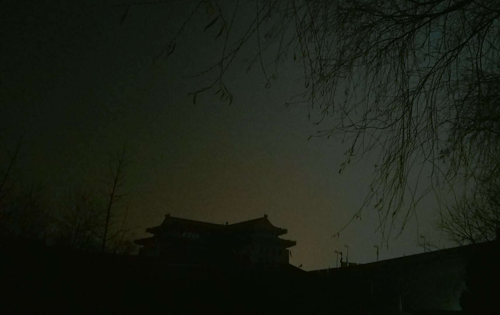
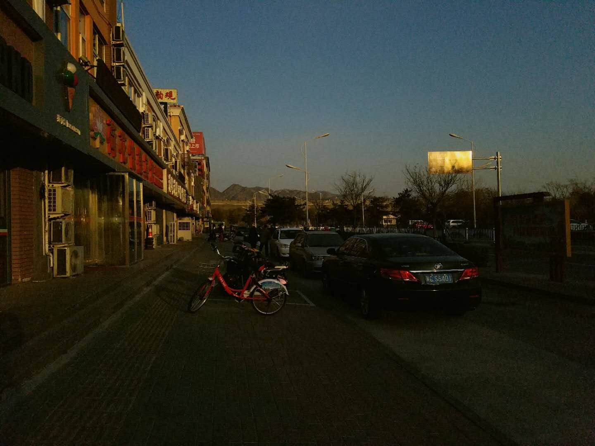

### 夜访山海关
早就想来山海关看看，于是在第十二个月的第一个周末，搭上了这趟从北京南驶往长春的火车。以山海关为界限，火车再往北方驶去，就是旧称的关外了。   

或许还不是出行的季节，车厢里很冷清。等火车开过了唐山，基本就剩我一人了。窗外一直是华北平原的灰色，没有起伏的一望无际，一直绵延伸展到我视线的尽头。眼睛很快就睁不开了，靠在椅背上慢慢睡了过去。直到负责这节车厢的列车员用好听的东北口音叫醒我说，山海关到了。   

临行之前其实一直是很忐忑的，怕“天下第一关的”名头叫了几百年，终难逃盛名之下其实难副。也是担心自己太过浅薄，融不进那座古城，害怕当七百年的城墙就伫立在我面前时，我只能触摸到十二月的寒冷，却体味不到它的温度。   

接近3小时的路程。   
火车继续往北开走了，那里可能会有我的下一次。   

从火车站走出来已经是黄昏了，夏天的时候此时应该还能够看见太阳向地平线落下去之前的光，可这个时节只能看见掺杂了重度雾霾后头顶的深灰色天空和一轮圆月，路灯下我看不出方圆一百米的轮廓，也无法辨认方向。好在对面的路口树立着一块「站前街」的路牌，我走到跟前看见周围的积水都结冰了，印满了横七竖八的车辙。我才发现对于小城区的人们来说，冬天的来临总是经纬分明的，水总是会在这个时候结冰，人们也要在这个时候穿好衣裳。   

我没有发现一点山海关的影子，尽管我就站在离它100米远的地方。它隐藏在这片黑夜里，从筑城开始，到终于在现实意义中失去它的军事价值，从战马嘶鸣的第一声开始，到如今习惯了游人如织的样子，从努尔哈赤、李自成的起义军、日本人的轰炸到现在每一块砖墙上被刻满游人的名字，荣耀和屈辱历尽七百年。   

我在火车站旁边的小酒店里预订了一个小间，房间挺小的，隔音也很差，但收拾的还算干净，起码能满足一个男生的要求了。前台负责办理住宿手续的大妈一脸阴沉，仿佛受够了这份糟心的工作，在我重复问了好几遍这个时间是否还能进山海关后，她才终于冷冷的回应我，城楼是上不去了，城墙底下你随便转。   

晚上零下二三度，我还是忍不住走了出去。高德地图上把我要去的目的地绘制成了一块奇怪的绿色正方形，沿着导航的路线从酒店门口的小街北行，很快就看见山海关古城墙了。跟我在西安看到的城墙不同，这里的城墙给我另外的一种感觉，虽然它一动不动的站立在那里，但我觉得它并不是安静的。古来征战的场景想必是深入了每一块砖石的缝隙，彷佛仍然在等待那些不会再归来的守关士兵，在它的身上架起弓箭和火器。而西安的城墙给人一种安稳厚重的感觉，我想这是跟孕育过汉唐的强盛分不开的。   

沿着城墙伸展的方向转向东走，沿途四五家卖小吃的摊车。他们可能做这个好多年了吧，每天晚上过来守着自己的生计，也守着不远处的山海关。希望以后也不会有城管来打搅他们，打断他们多年的习惯。人是喜欢维持习惯的，优秀或者平庸，习惯也是很难有力气摆脱的，当被迫的选择改变这种习惯时，结果要么沉沦要么重新活一次，而这两种都很痛苦。   
还是希望他们能有更多的选择吧。   

我游荡在晚上的城墙下，偶尔能看见三三两两的当地人散着步往回走，另一侧的店铺都已经关门了，也能偶然看见门口亮着灯的小胡同，胡同里面挺深，也挺安静。我在门口拍了照接着往前走，走到夜深人静才回去。   

小房间里能听到不远处火车站里那些火车的汽笛声，有的是到达，有的是启程，但声音听起来都一样，像某人第一次吹响了萨克斯。   

    
    
<i>【夜色中的靖边楼】</i>

### 老龙头

    
    
<i>【山海关的清晨】</i>

睡了一夜不好不坏的觉，第二天清晨七点就醒了。最近一直在坚持七八点起床、跑步，所以今天也没有什么赖床的想法。在昨天吃晚饭的小餐馆要了早点，一碗豆腐脑，一碗粥，三个素包子和一枚茶叶蛋。一直以来早饭都吃不多，粥是我后来点的，这里的豆腐脑实在是太难吃了，放了酱色的卤汁，粘稠的像一碗枇杷膏。我很怀念小时候吃过的豆腐脑，豆腐铺的老板担着挑子走街串巷，走几步便把手里的梆子敲一下，清脆的声音传出去很远。   

做豆腐是件辛苦的事，这么多年来我也只见过他一家在做。记得小时候我妈见我很喜欢吃豆腐脑还专门跑去跟人家请教，她一直是非常喜欢学习的人。不过做出来的豆腐脑却不咋样，既不上相也不好吃，涩涩的。我加了很多辣椒和醋才勉强吃了几口，再吃肯定就得吐了。   

因为山海关的古城区就在山海关火车站旁边，所以我打算先去海边的老龙头然后再回到这里。早就查过了去老龙头的路线，公交站在马路对面，大约20分钟的车程，一路上都是迎面而来的阳光，透过车窗洒在脸上。我眯起眼感受着这个小城区的缓慢，那是一种来之则安的平常。我们也曾经这样缓慢的生活过，曾经的每一天觉得足够长，一年也足够长，成长总是觉得在很遥远的未来，遥远得像是下课的铃声，像在操场上把足球踢出的长长弧线，像你我想象未来时被路灯拉长的影子。终于我不再期盼这下课的铃声，那枚足球被谁踢进了夕阳里再也找不回来了，我们失去了消息。   

正是旅游的淡季，老龙头的门票20块钱，比旺季便宜一些。景区入口的后面就是宁海城的高大城楼，一步步走过去，尽管知道这是重修的，仍然会有一种靠近历史的感觉。穿过城门大敞的门洞，就进入宁海城了，这里面保存了明代驻守此处的水师营地「龙武营」。穿过了城门，我没有向前直走，右转上了石阶，沿着一条种满白杨的小路钻进了营地。营地看起来不算大，反倒是里面的关帝庙占据了不小的面积，庙门落着锁。在营地里继续发现了点将台、八阵图等，大约能够想象一下几百年前士兵的生活场景。我很快就绕出了营区，这里给我的感觉像是我小学时代的学校，给我莫名其妙的压抑。我想如果我穿越过去，一定不是个好士兵。   

继续往里走，或者说是往外走也行，因为前方是大海，敌人会从那个方向进攻。眼前是一道宽阔的石阶，宽阔的能并排通行两辆重型卡车。石阶上方尽头是「澄海楼」高大的城楼，重檐斗拱气派非凡。沿着石阶走上去，风就突然地呼啸起来了，大海一下子出现在视线里，像是等待了很久。   

站在澄海楼的脚下，就是站在老龙头的高处了。极目望去，是海水和天空在尽头汇聚的苍茫一色，潮水从那个方向涌来，拍打在延伸进海水中的长城和礁石上，接着褪去，而后又再次涌来，年复一年。七百年的时间对于潮水来说太过于渺小了，它还记得上一次褪去的时候正看见蒙古人的骑兵趁着潮落踩着沙滩喊杀而来，又被敌台里的士兵坚决的打了回去。如今它再次涌来，这里已经人去楼空。东北方向建起了港口，一座座红色的巨大塔吊直插海底，日夜不休的作业。这个海湾从来都没有失去过热闹，明朝人来过，蒙古人来过，清朝人来过，八国联军来过，日本人又单独来了一次。   
又该退潮了，沙子重新露出了水面，留下被捎带上来的蛤蜊，在沙滩上努力地挖掘，一点点沉进沙里。   

在澄海楼里简单看了一圈，面积不大，但是有能上二层城楼的楼梯，不过现在被挡起来了。上层城楼上挂着明末大学士孙承宗题写的「雄襟万里」的匾额。想来当真让人敬重，当努尔哈赤的骑兵连战连捷，大明边防告急的时候，孙承宗以一介文官统军十一万，收复失地四百余里，修筑大城九座，小城堡四十余座，屯田五千多顷，安置战争难民近百万，逼迫努尔哈赤后退七百里，让大明续命几十年。我很奇怪明末的这种现象，文官往往出尽了武功的风头，甚至成为传奇，像后来的袁崇焕、卢象升、洪承畴、孙传庭，上马是统兵的将军，下马是儒雅的诗人。天生的将军和诗人，天生的力挽狂澜的人，最后也都看狂澜力挽不住滔滔奔去。难以评说崇祯皇帝到底是不是位好皇帝，只能感叹气数已尽。手里的牌不算差，却每每自毁长城。   

出来澄海楼往下走，去看延伸进海里的这段长城。风已经很大了，透过城墙上的垛口往人身上猛扑，我穿的羽绒服感觉凉透了，冷风透过衣服的每一处缝隙往身体里钻。我试着探出头想拍一张从垛口里看出去的照片，大风马上灌进口鼻里让我不能呼吸，转身靠在城墙上大口喘气。想起手握铁枪沿着城墙巡逻的古代兵士，我才又重新直了直身子。海边有的是这样的大风和这样的寒冷，如今的我很难想象得到那些士兵年年坚守的力量来自哪里，恐怕不止是军纪而已。

再往前走就是「靖卤台」了，当年戚继光在这里修筑的第一个海上敌台。它有一部分身体没入了海水中，是明长城的东方起点。敌台里的风小了许多，却依然冷飕飕的。通过敌台里的多个垛口，能看到外面的情况。在这里戚将军不会担心倭寇，他们更常出没在海岸线绵延的东南沿海，他担心的是蒙古人，被赶进草原和大漠的蒙古人早就恢复了游牧民族劫掠农耕文明的习惯，当这片潮水褪去，细软的黄沙也会挡不住蒙古人的马蹄了。   

那时的皇帝还不是崇祯，明朝的边境上也还没出现太大的危机，关外的部落刚刚诞生了一个婴儿，叫努尔哈赤。此时的嘉靖皇帝已经算得上一位老人了。他命戚继光去东南沿海打击倭寇，这位不世出的名将带领着他的戚家军用十余年的时间扫平了多年为虐沿海的倭患，后来又北上防御蒙古部落犯边十余年。这老龙头大概就是在他后来的十余年里修筑的。渤海湾的海风吹寒了将军的甲衣，想必最后也吹寒了那颗滚烫的人心，正是它催发的血液，曾经如渤海湾的潮水一样澎湃。我忍不住想起这半首诗，
> 封侯非我愿，但愿海波平。
> --- 戚继光   

从靖卤台的垛口望出去能看到南面的「海神庙|，有一小半浸泡在海水里。下了靖卤台，向着海神庙走过去，海风把沙子吹进了嘴里，尝起来像是细小的盐粒。   
可能因为气温的原因，手机的电量从50瞬间掉到了3，幸好还带了单反。只是一直没怎么用，反而不如手机拍起来方便。在海神庙里我没有拍照，神像和夜叉塑造的太过于巨大和逼真了，让我觉得很不自在。庙里站满了塑像，我一个人站在庙里，四面八方，目光如电。   

我呆了一分钟，就离开了这里。   

    
    
<i>【从靖卤台的垛口望向海神庙】</i>

### 天下第一关
还是坐那趟公交车回去，在「天下第一关」下车。   

长城一直是古代中原王朝抵御北方游牧民族的重要防线。自秦长城以来，以后的朝代均有不同规模的修筑。   
明朝建立后，被赶进北方大漠的蒙古骑兵时常南下叩关，所以在其200多年时间里，对北方长城的构筑和加固始终没断过。后来蒙古部落衰落，东北方向的女真人崛起。敌人成为朋友，朋友变成了敌人，北方边境上的压力始终存在，只是防守的压力逐渐向东北迁移，其中最为我们熟悉的就是袁崇焕构筑的「关宁锦防线」以及「辽西走廊」。辽西走廊呈东北-西南走向，约185公里，东接渤海（辽东湾），向西连接松岭山，对于不擅于航海的女真人来说，想要进攻关内，首选的路线便是这条狭长的辽西走廊了。关宁锦防线便是沿着辽西走廊的方向构筑，对于大明帝国的重要性可以说是性命攸关。而山海关是这条防线的后盾，是最靠近关内的防守力量，是大明帝国最后的希望。山海关一旦被从北方攻破，向南就是无险可守的华北平原了。   

在我看来，这就是山海关成为天下第一关的原因，不仅仅是因为它是明长城的东部起点，更是因为明代独特的地缘政治决定的天下第一的战略位置。   

只买了去「天下第一关」城楼的票，15块钱。沿途可以经过「靖边楼」和连同天下第一关在内的三座城楼，对我来说已经要走很远的路了。   
靖边楼很气派，是一座防御性的建筑，大概是可以在城楼内通过墙上开设的洞口射击城墙下的敌人。遗憾的是如今的靖边楼已非明代遗留下来的老建筑，而是建国后的复制品。明代的老楼被关东军的大炮炸毁了，一座冷兵器时代的传奇，风雨不动几百年后，终究毁于现代文明的炮火。   

离开了靖边楼，沿着城墙上宽阔的道路继续向西走，远远的能望见前面三座耸立在城墙上的城楼，每座中间隔了差不多的距离，中间的一座就是「天下第一关」了。可能是我靠它太近，也可能是冬日的太阳斜斜的落在城楼的上方让我无法抬起头来看，它看起来没有那么雄伟，至少不是我想象中的样子。它跟靖边楼一样的漂亮，是一件巨大的建筑艺术品，却曾无数次承受着城墙下飞来的箭矢和投石，成片的敌人倒在它的脚下，后面是又一批敌人涌上来，云梯推到了又被重新竖起来，护城河里流淌着血液。铁铸的大炮每一声巨响都让它震耳欲聋，战马嘶鸣，将旗飘扬，猎猎风声。只要是兵临山海关下的战斗绝不会轻描淡写，这最大的一次，也许要说到李自成和吴三桂、多尔衮的山海关之战。当时李自成已经攻进北京坐在了崇祯皇帝的金銮殿上，后者在前一天吊死在了煤山的枯树上。李自成本想说服吴三桂归顺的，可最终好事不成，于是有了后来的冲冠一怒为红颜，吴三桂、多尔衮的联军在山海关打败李自成的「大顺」军队，当了没多久皇帝的李自成退出北京。自此，山海关大开，满八旗像洪水一样从山海关奔泻南下，关内与关外成了名义上的一家，山海关再也不复往日的地位。   

突然就想起公司附近的那家关内关外，是不是地道的东北味儿我不知道，饭菜做的还算可以。哪天看我顺眼的时候，不如约我一块去坐坐吧。我想听你讲，你的故事，那里有我要等的风，我的潮汐、朝阳、落日，我关心的所有关于你的平凡小事，所有你想凝望的星辰大海。   

继续向前吧，天下第一关再往西走是「临闾楼」。城墙两面的城砖上刻满了游玩者的名字，刻痕深深浅浅，刀伤密密麻麻。我把自己的影子投在城墙上，然后对着他按下快门。   

    
    
<i>【天下第一关西面的临闾楼】</i>

### 归程
不知道从什么时候起，身边的游人开始多了。一群学生模样的人好奇的摸遍了遍布城墙上的兵士铸像和铁炮黑洞洞的炮口，然后合影，嬉戏。真是个好年纪啊，要是能穿越回去多好，也许会去走一条不同如今的路，可我又害怕那条路遇不到你。   
是时候离开了，这人群出现的刚刚好。我还是那么的享受孤独，又那么的害怕孤独。我对着第一次见面的人交浅言深，我对着自己的影子掏心掏肺，我对自己说如此最好。   
就像冰冻三尺下的一条傻鱼，当猎鱼的人在冰面上砸开了窟窿，阳光和氧气像毒药一样浸泡在那片水域，我像春信来时那样欢快的游过去，以为这个冬天过去了。其实就算鱼看破了陷阱又有什么用呢，它无法停止自己，游向热爱的阳光和氧气。对热爱的视而不见，你说是成长，我说是死去。   

时间从未改变过我对世界的想法，17岁的我住在我的身体里，当夜晚来临，这躯壳睡去，他会一个人继续旅程。   
从山海关北上，去看那里的雪会下多大。   

因为没有提前买回北京的车票，只能临时在山海关火车站的窗口买到了一张从沈阳北南下的动车，无座。我站在两节车厢的接头处，一边充电一边翻看着相机里的照片，山海关的探访结束了。   

不好不坏的旅行，走了一段路，看了一些景，想起了很多事情。去一些年轻的城市玩吧，不要一个人的时候来山海关。   

透过车窗的玻璃，外面是华北平原的冬季，我在等风到来，等不到你的消息。
   
   
   
十二月的狸猫   
<i>12/07/2017</i>

    

