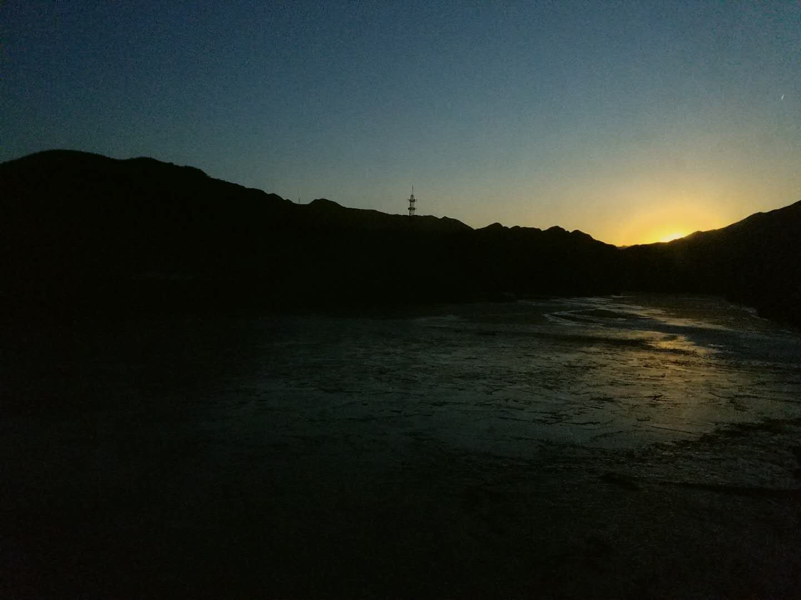

当你一个人走在路上的时候才会有俯下身子看蚂蚁搬家的兴致，这是一个人旅行的好处。也只有如此，我才能会更加看清楚未来的样子，等我回归到生活的时候，看你柳眉倒竖也好，眉眼带笑也好。   

这次是从北京去大同，从东向西，从华北平原的北部边缘到黄土高原的东部边缘，中间是巍巍耸立的太行山脉。来去都没有高铁，只有绿皮火车可以坐，座位比较拥挤，也没办法充电，旅程会稍微显得有些无聊。好在窗外的夕阳和太行山的层层山峦还不算单调，只是在傍晚看起来有些冷清。火车从一个隧道驶出接着驶入下一个隧道，光与黑暗不断交替，一直挣扎到夜色降临。隧道里低频噪音对耳膜的压迫让我听不太清楚车厢里的声音，大家都开始逐渐的眯上眼睛休息，只有一两个小孩子不知疲倦的顺着过道窜来窜去，每隔一段挺长的时间会有卖零食饮料的列车员推着小车经过，我本来想吃点什么，最后什么也没买。   

晚上吃的火车上提供的盒饭，15块钱一份。有两个菜，一个是胡萝卜炒洋葱，另一个是洋葱炒胡萝卜，味道是酱油的味道。   

天完全黑下来以后也没有想睡的意思。火车经过的地方大部分是荒郊野外，没有灯光，眼睛贴在窗子上看出去也只能看见同侧的铁轨在飞快的向后退去。偶尔会经过一个小站，吊着橘黄色的大灯，勉强照出来小站的轮廓。值晚班的人穿着冬季的厚制服站在这灯影里，注视着火车开过去。我看不清他的脸，模糊如同身后的小站。小站的身后，是模糊的黑色大山。   

    
    
<i>【傍晚】</i>

